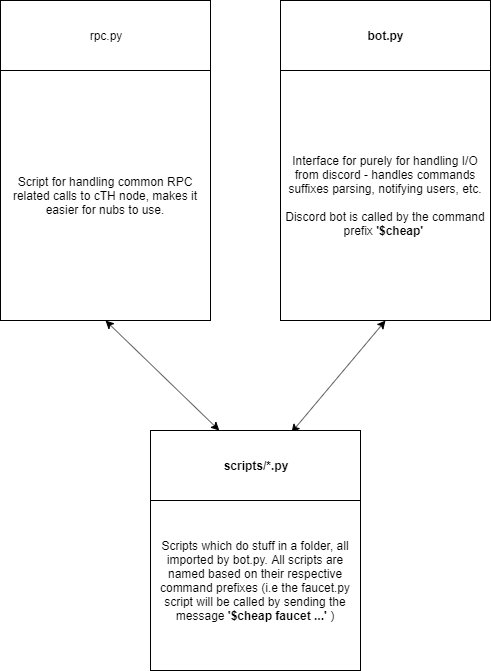

# Contributing to cTH-Party

👍🎉 First off, thanks for taking the time to contribute! Your are one step closer to becoming a part of the cheapEth family 🎉👍

## Adding more commands

Fork repo, then send a pull request that which meets the following criteria:

- The script for the command must be placed into the `scripts` folder, with the
  command suffix as its filename. e.g. calling `$cheap lulz` via discord should
  call the script `lulz.py` from within the `scripts` folder.
- The script must have a `run` function, as this is what is called by the
  `bot.py` script. The run function must take two params: `client` and `message`
- Describe your script in the README.md properly so everyone knows how to use it and what it does.

## Structure

